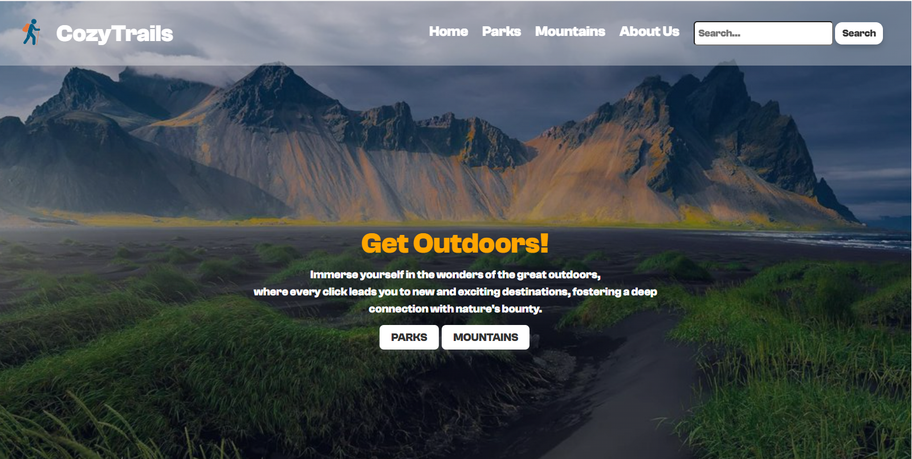
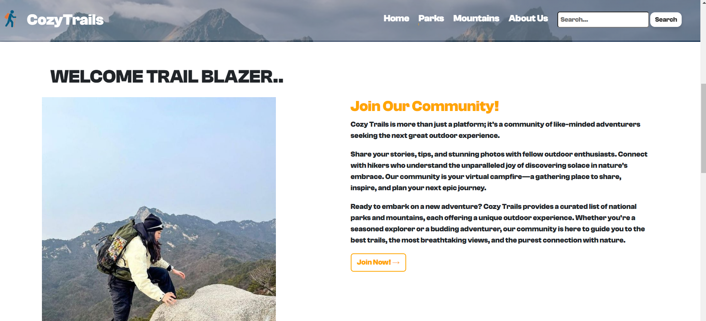
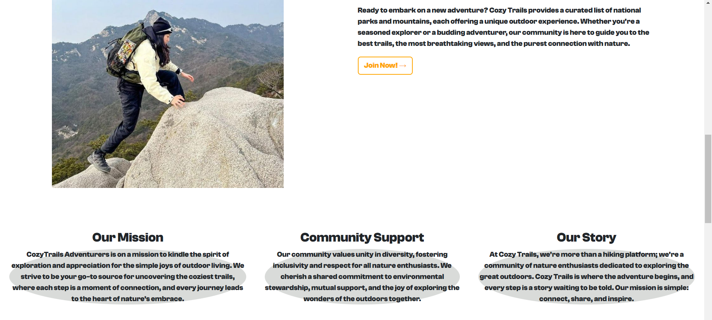
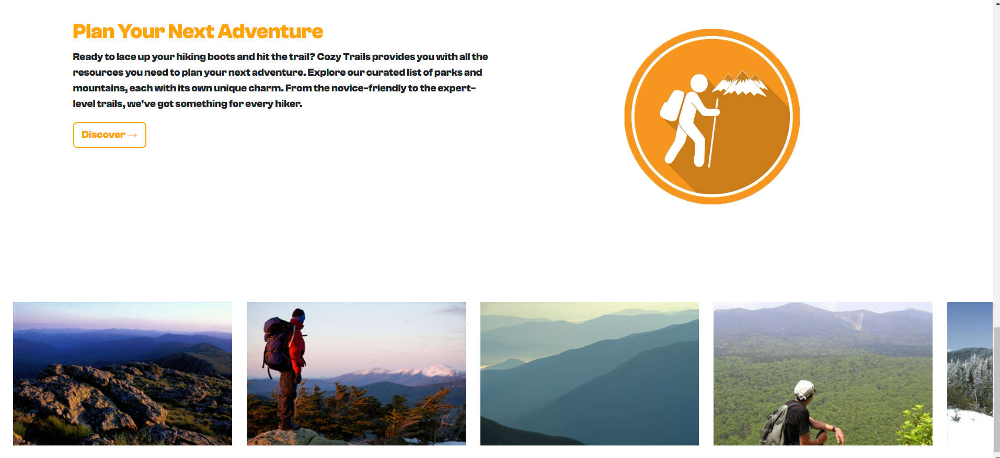
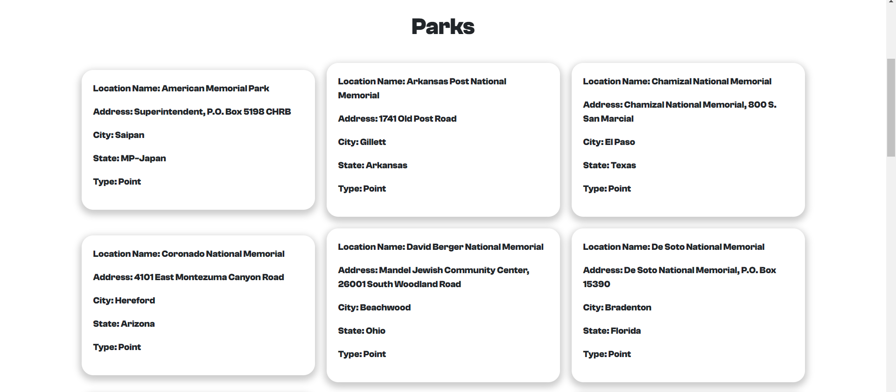
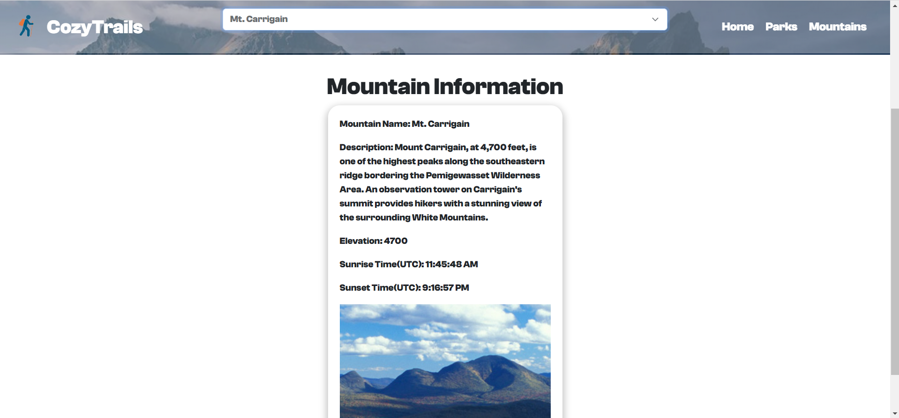

#CozyTrails README

##Overview

CozyTrails is not just a website; it's an invitation to embrace the great outdoors. The primary goals
is to help users discover natioanl parks and mountains for a nice outdoor experience. Lets take a closer look!

A captivating introduction encourages users to "Get Outdoors!" over our hero image. I have quick links to Parks and Mountains for immediate adventure planning.

#Index Features

Hero:

Navigation:

A user-friendly navigation bar allows seamless access to Home, Parks, Mountains, and About Us.
An integrated search bar for quick exploration.
A cool Feature is 
1. when You hover you cursor above one of the nav links you will get a orange line below your selected option.
2. The Navigation bar has a sticky Nav bar
3. The content Page is fixed and over takes the page when scrolling on.

Community Hub:

"Welcome Trail Blazer" section invites users to join the CozyTrails community.
Information about CozyTrails being more than just a platform - a community of outdoor enthusiasts sharing stories, tips, and photos.

Highlights CozyTrails' mission, story and community support

Adventure Planning:

"Plan Your Next Adventure" section provides resources to plan hikes and explore curated parks and mountains.
A call-to-action to discover more about upcoming adventures.

Visual Appeal:

Engaging image carousel showcasing stunning landscapes, fostering excitement for exploration.

with the filter hover:

##ParksPage

Here we have 2 drop downs however in my html I made e3 dropdowns but for the user experience I have hidden ParkType to 
create a simple user experience:
I use JavaScript to populate the dropdowns and add it in cards

##MoutainsPage 

Here I do the same thing but I with the stretch goals

